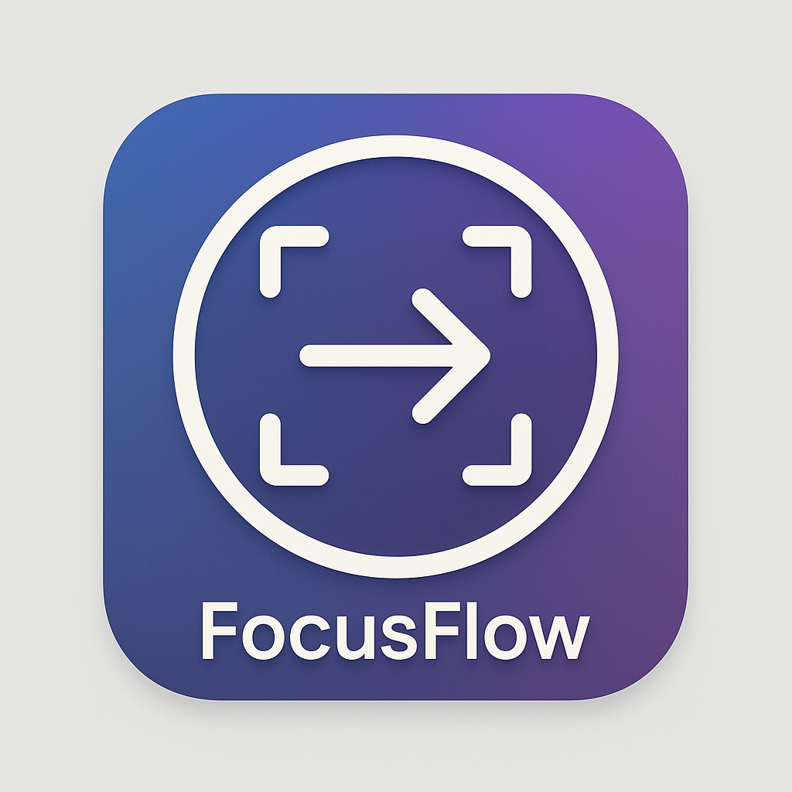

# FocusFlow

<p align="center">
  
</p>

A powerful task management and time tracking application built with Tauri, React, and TypeScript to help you stay focused and productive.

## Features

- **Task Management**: Create, organize, and track tasks with ease
- **Time Tracking**: Monitor time spent on tasks with built-in timer functionality
- **Categories**: Organize tasks into customizable categories with color coding
- **Analytics**: Visualize your productivity patterns with intuitive charts
- **Notes**: Attach rich text notes to your tasks
- **Cross-Platform**: Works on Windows, macOS, and Linux thanks to Tauri

## Installation

### From Releases

Download the latest installer for your platform from the [Releases](https://github.com/GxAditya/focusflow-codebuff-hackathon/releases) page:

- Windows: `focusflow_x.x.x_x64-setup.exe`
- macOS: `focusflow_x.x.x_x64.dmg`
- Linux: `focusflow_x.x.x_amd64.AppImage` or `focusflow_x.x.x_amd64.deb`

### Building from Source

Prerequisites:
- [Node.js](https://nodejs.org/) (v18 or newer)
- [Rust](https://www.rust-lang.org/tools/install) (latest stable)
- Platform-specific build dependencies for Tauri - [see here](https://tauri.app/v1/guides/getting-started/prerequisites)

```bash
# Clone the repository
git clone https://github.com/GxAditya/focusflow-codebuff-hackathon.git
cd focusflow

# Install dependencies
npm install

# Development
npm run dev

# Build for production
npm run build
npx tauri build
```

The compiled binaries will be available in the `src-tauri/target/release/bundle` directory.

## Usage

### Task Management

- Create tasks with title, description, due date, and priority
- Assign categories to tasks for better organization
- Filter and search tasks by various criteria
- Track completion status

### Time Tracking

- Start/stop timer for any task
- View time spent on individual tasks
- Analyze productivity with built-in charts
- Export time data for reporting

## Development

### Project Structure

```
focusflow/
├── src/                # Frontend React code
│   ├── components/     # UI components
│   ├── stores/         # State management
│   └── styles/         # CSS/styling
├── src-tauri/          # Rust backend code
│   ├── src/            # Rust source files
│   └── Cargo.toml      # Rust dependencies
└── package.json        # NPM dependencies
```

### Technology Stack

- **Frontend**: React, TypeScript, Mantine UI
- **State Management**: Zustand
- **Backend**: Rust, Tauri
- **Database**: SQLite with better-sqlite3
- **Charting**: Recharts

## License

[MIT License](LICENSE)

## Contributing

Contributions are welcome! Please feel free to submit a Pull Request.

1. Fork the repository
2. Create your feature branch (`git checkout -b feature/AmazingFeature`)
3. Commit your changes (`git commit -m 'Add some AmazingFeature'`)
4. Push to the branch (`git push origin feature/AmazingFeature`)
5. Open a Pull Request
